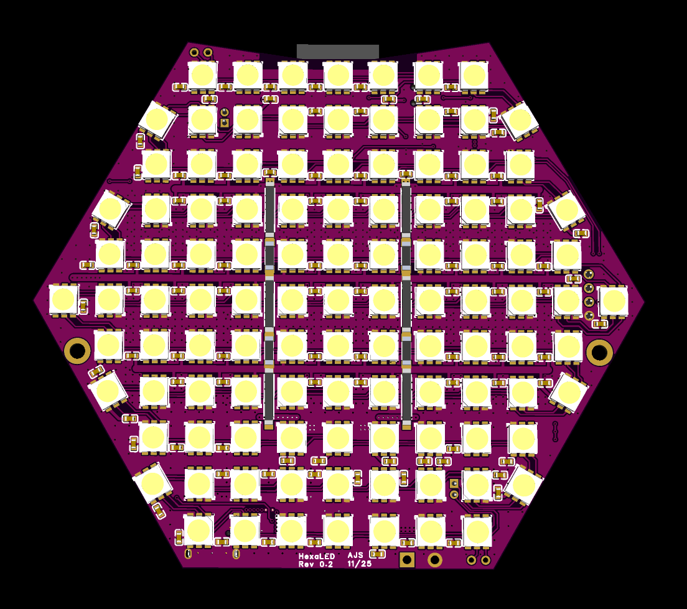
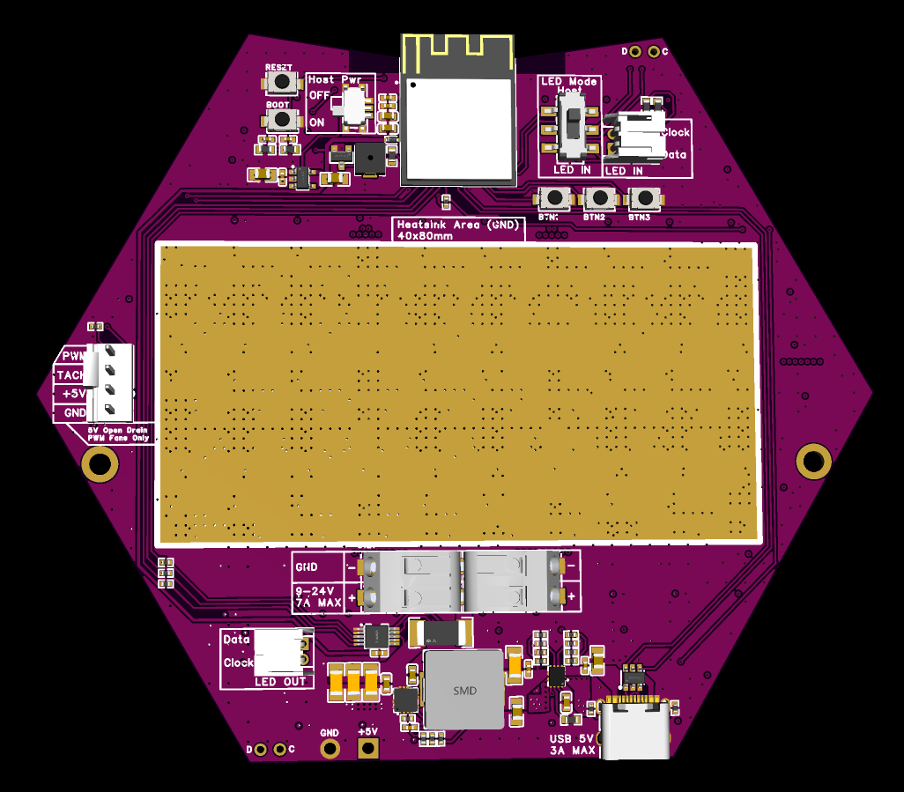

# HiveLED

Hexagonal LED matrix display with 107 individually addressable LEDs (SK9822-A), onboard ESP32-S3 MCU, buck converter, current/temperature monitoring, and PWM fan headers with 40x80mm board area reserved for an optional heatsink. Designed to be compatible with WLED. Multiple panels can be chained together and driven by a single 9-24V power supply. LED display input can be controlled by the onboard MCU, received over a network, or hard wired with onboard JST connectors.




## Specs
- 107x SK9822-A LEDs (max 55mA each)
- Max power consumption: 28W
- Min input voltage: 9V
- Max input voltage: 24V

## Warning

Dense LED matrix displays like this one have the potential to generate A LOT of heat. With all safety limits disabled at full brightness, these LEDs can produce enough heat to cause a catastrophic meltdown.

Managing Heat:
- Use the "Current Limiter" feature of WLED. 2000mA is a reasonable limit. This is only a soft limit for the brightness control based on estimated current by WLED. The brightness slider in WLED is scaled by a factor of ```(WLED Current Limit/Potential MAX Current)```. IMPORTANT: The INA228 current displayed in WLED when using the usermod is the current of the input power supply inclusive of all components at the input power supply voltage. The "Estimated Current" in vanilla WLED is only an estimate of the current drawn by the LEDs at 5V. When using a 12V power supply, the estimated current in WLED will indicate higher than the INA228 current because ```Current = Voltage / Resistance (load)```, often defined as V=IR.
- Use the INA228 Usermod and configure emergency shutoff based on over-temperature or over-power conditions. 70C is a good temperature limit for enclosures printed in PETG. 
- Use a 5V PWM fan and 40x80mm heatsink to dissipate heat more effectivley. The recommended fan is a Noctua NF-A4x10 5V PWM. One, or two with a 4-pin splitter. 40x40mm or 40x80mm heatsinks are commonly available online. A PWM fan and aluminum heatsink can reduce the max temperature of the board at 50% brightness by 15C. This can help extend the life of the LEDs or enable higher current/brightness limits.


## WLED Setup

https://kno.wled.ge/

### LED Settings

- LED Type: APA102 (similar timings to SK9822)
- Clock Speed: Fastest
- Num LEDs: 107
- Data Pin: 35
- Clock Pin: 36
- Button 1 Pin: 47
- Button 2 Pin: 33
- Button 3 Pin: 34

### INA228 Usermod
The HiveLED matrix contains an onboard INA228 IC for monitoring the temperature of the PCB and real-time power consumption. These features provide additional diagnostic information and can be used as an electronic fuse as a backup to the "soft" current limiter built into WLED. These features also enable automatic temperature control with a 5V PWM fan and optional heatsink. Accurate temperature monitoring and configurable emergency shutoff functions protect the (most likely 3D printed) enclosure, extend the life of the components, and reduce the risk of catastrophic failure.

I will submit a pull request to add the INA228 usermod to WLED soon. To build your own binaries that include support for the INA228 features, see my fork of the WLED repo.

### Usermod Pin Settings

Config > Usermods

- Global I2C SDA Pin: 15
- Global I2C SCL Pin: 14
- INA228 Alert Pin: 16
- Fan PWM Pin: 12
- Fan Tach Pin: 13
- Buzzer Pin: 9